# **`Task 1`**: Create homepage and styling
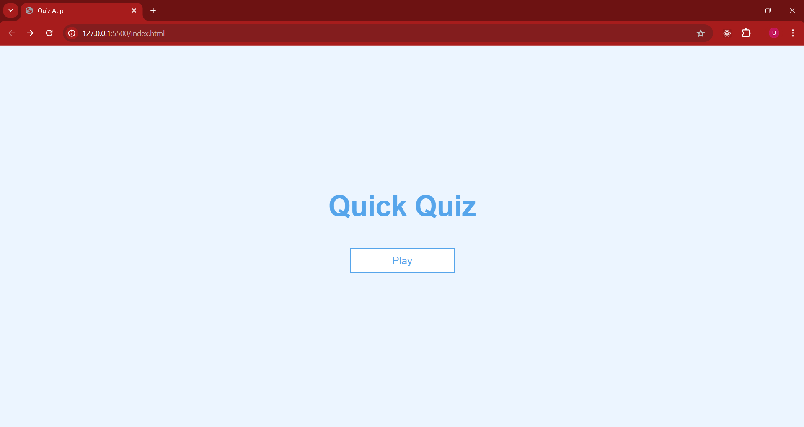

# **`Task 2`**: Create & Style game page
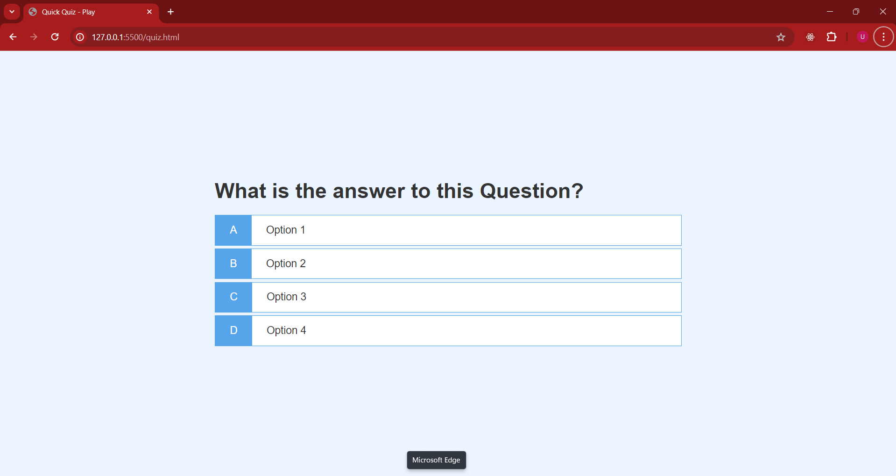

# **`Task 3`**: Display Hard Coded Question and Answers

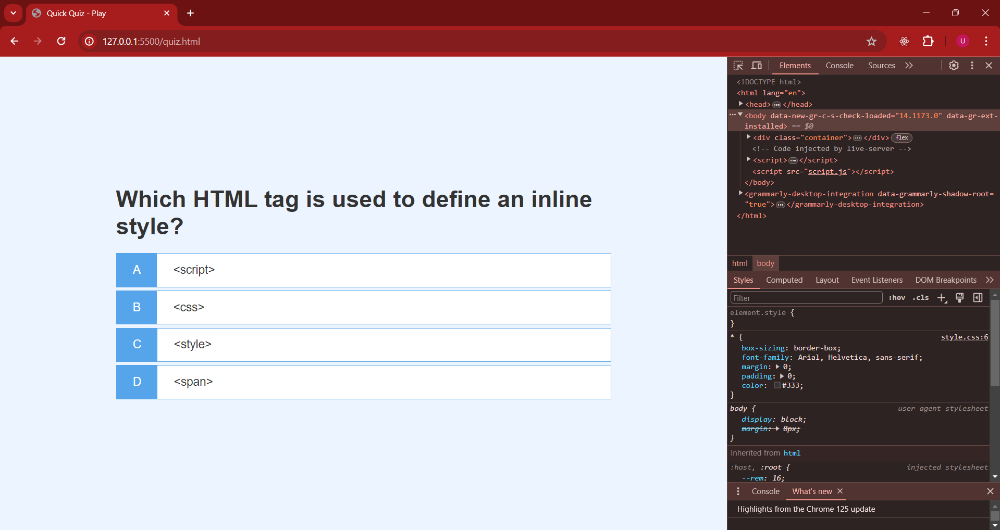
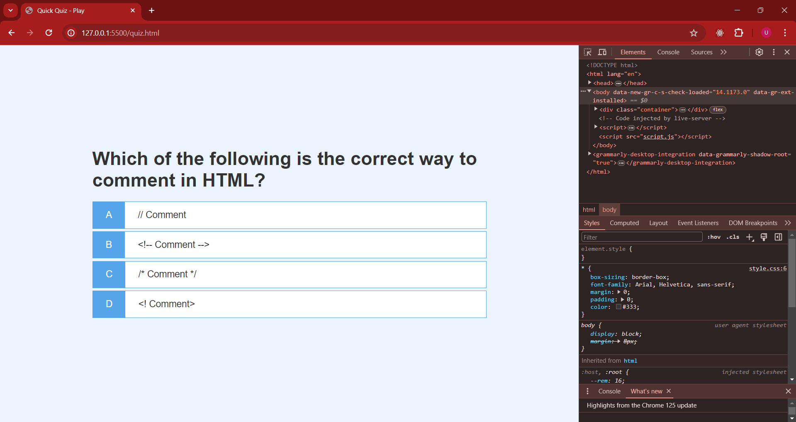

# **`Task 4`**: Display Animations for Correct and Incorrect Answers
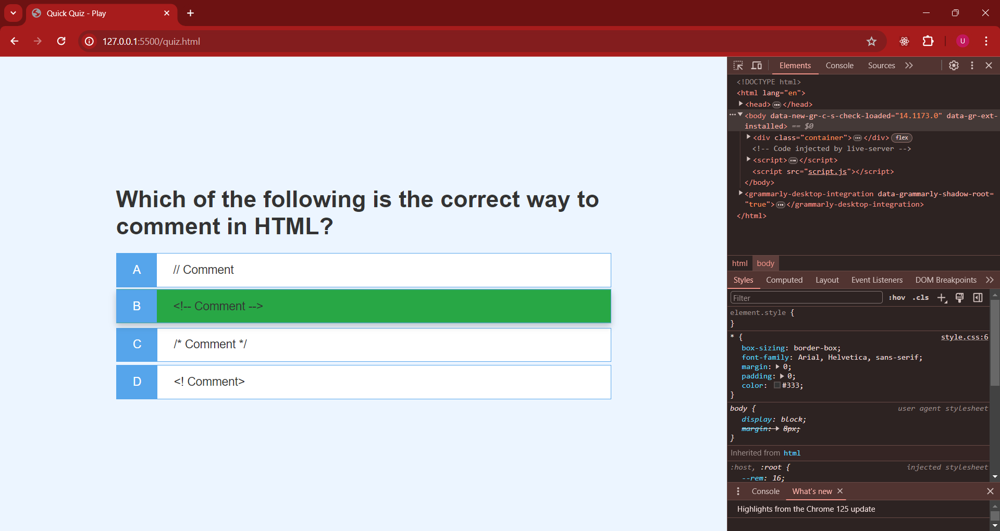

# **`Task 5`**: Create a Head’s Up display 
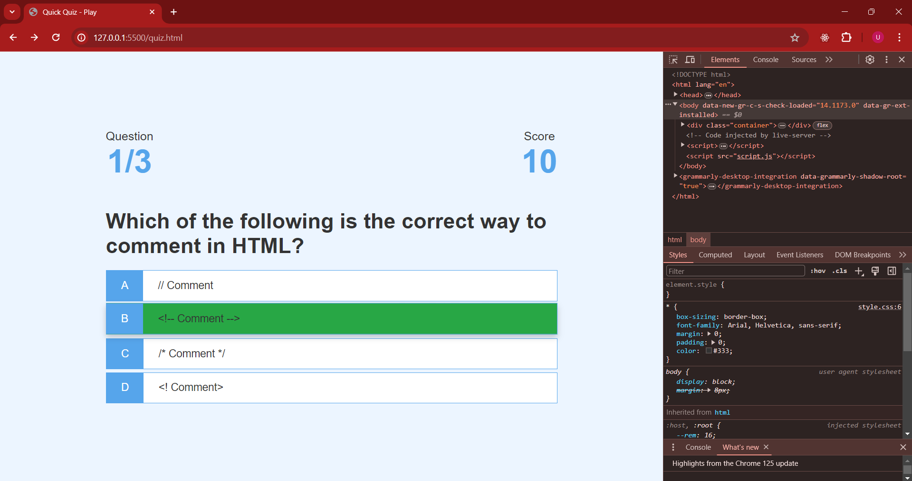
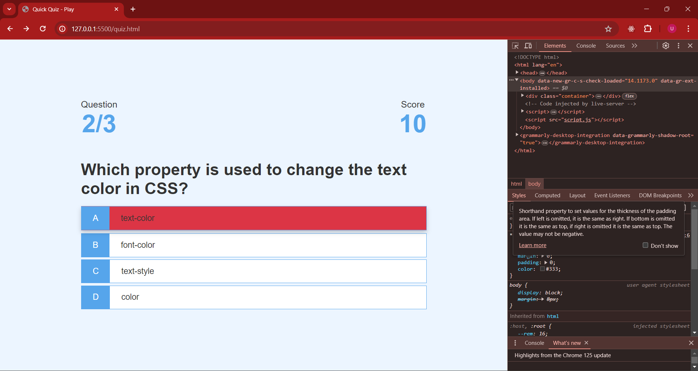
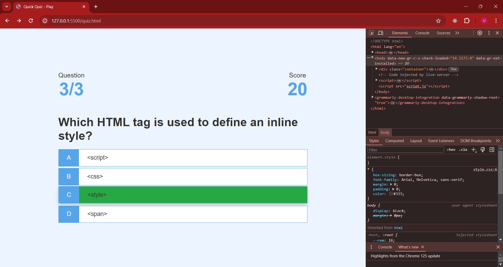

# **`Task 6`**: Create a Progress Bar
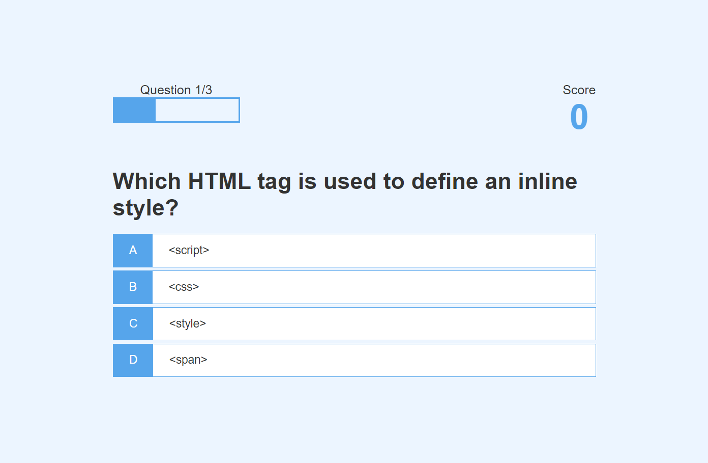
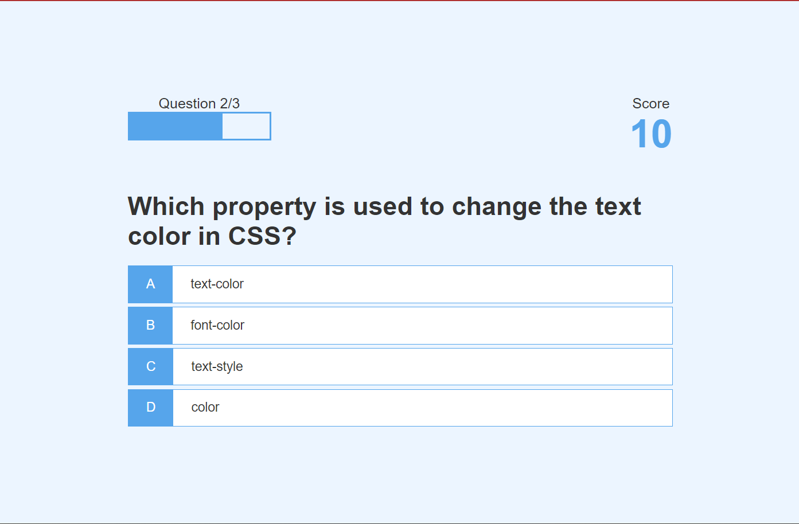
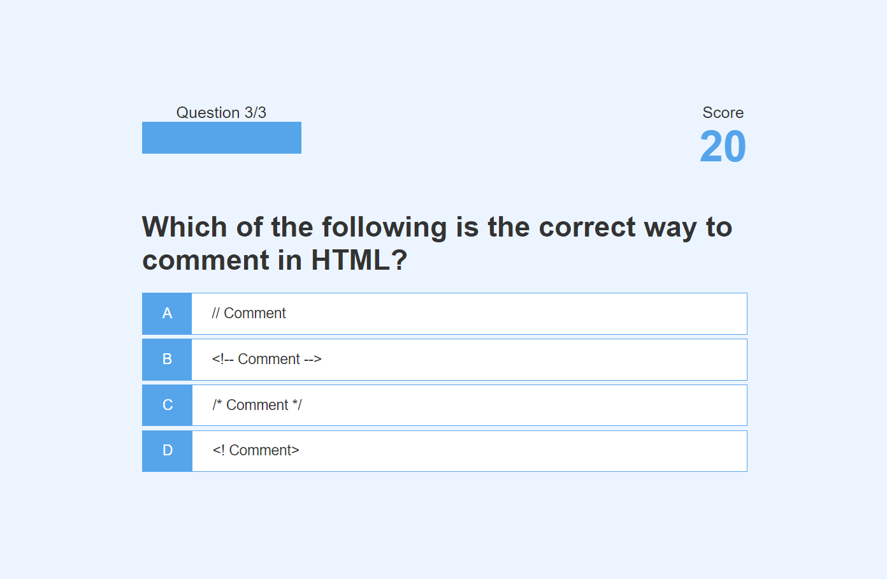